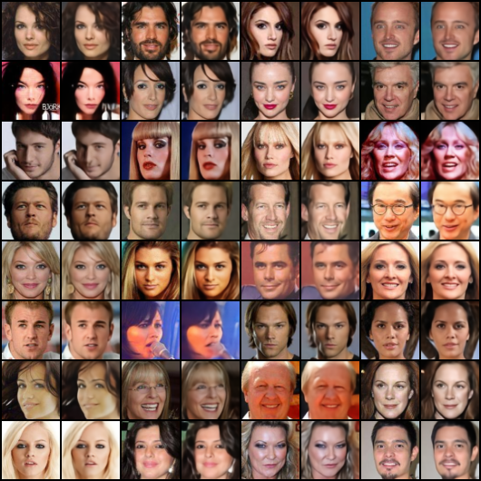
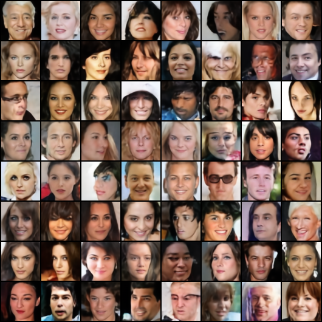
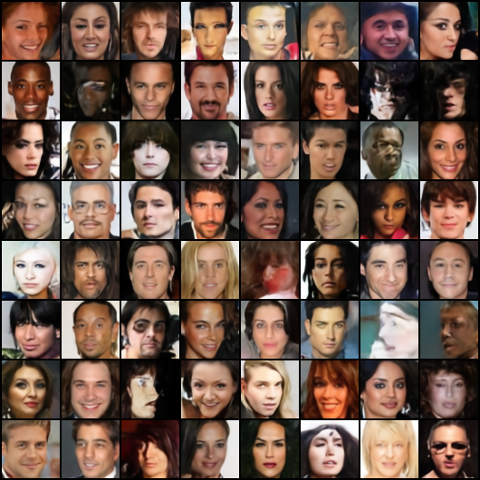

# vqvae-pytorch

> Van Den Oord, Aaron, and Oriol Vinyals. "Neural discrete representation learning." Advances in neural information processing systems 30 (2017).

Unofficial implementations of VQVAE.

<br/>


## Installation

Clone this repo:

```shell
git clone https://github.com/xyfJASON/vqvae-pytorch.git
cd vqvae-pytorch
```

Create and activate a conda environment:

```shell
conda create -n vqvae python=3.11
conda activate vqvae
```

Install dependencies:

```shell
pip install -r requirements.txt
```

<br/>


## VQ Model

### Training

```shell
accelerate-launch scripts/train_vqvae.py -c CONFIG [-e EXP_DIR] [--xxx.yyy zzz ...]
```

- This repo uses the [🤗 Accelerate](https://huggingface.co/docs/accelerate/index) library for multi-GPUs/fp16 supports. Please read the [documentation](https://huggingface.co/docs/accelerate/basic_tutorials/launch#using-accelerate-launch) on how to launch the scripts on different platforms.
- Results (logs, checkpoints, tensorboard, etc.) of each run will be saved to `EXP_DIR`. If `EXP_DIR` is not specified, they will be saved to `runs/exp-{current time}/`.
- To modify some configuration items without creating a new configuration file, you can pass `--key value` pairs to the script.

For example, to train a vqvae on CelebA with default configurations:

```shell
accelerate-launch scripts/train_vqvae.py -c ./configs/vqvae-celeba.yaml -e ./runs/vqvae-celeba
```

### Evaluation

```shell
accelerate-launch scripts/evaluate_vqmodel.py -c CONFIG \
                                              --weights WEIGHTS \
                                              [--bspp BSPP] \
                                              [--save_dir SAVE_DIR]
```

- `-c`: path to the configuration file
- `--weights`: path to the model weights
- `--bspp`: batch size per process
- `--save_dir`: directory to save the reconstructed images

### Results

**CelebA(64x64)**:

<table>
    <tr>
        <th style="text-align: center">Model</th>
        <th style="text-align: center">Codebook usage</th>
        <th style="text-align: center">PSNR</th>
        <th style="text-align: center">SSIM</th>
        <th style="text-align: center">rFID</th>
    </tr>
    <tr>
        <td style="text-align: center">VQVAE (VQ loss)</td>
        <td style="text-align: center">56.45%</td>
        <td style="text-align: center">31.5486</td>
        <td style="text-align: center">0.9389</td>
        <td style="text-align: center">16.8227</td>
    </tr>
    <tr>
        <td style="text-align: center">VQVAE (EMA)</td>
        <td style="text-align: center">100%</td>
        <td style="text-align: center">32.0708</td>
        <td style="text-align: center">0.9459</td>
        <td style="text-align: center">15.5629</td>
    </tr>
</table>

<table>
    <tr>
        <th style="text-align: center">VQVAE (VQ loss)</th>
        <th style="text-align: center">VQVAE (EMA)</th>
    </tr>
    <tr>
        <td style="text-align: center"></td>
        <td style="text-align: center"></td>
    </tr>
</table>

It can be seen that the EMA codebook achieves better reconstruction quality and codebook usage than the VQ loss codebook.

<br/>


## Prior Model

### Training

```shell
accelerate-launch scripts/train_prior_transformer.py -c CONFIG [-e EXP_DIR] --vqmodel.pretrained /path/to/vqmodel/checkpoint [--xxx.yyy zzz ...]
```

### Sampling

```shell
accelerate-launch scripts/sample.py -c CONFIG \
                                    --vqmodel_weights VQMODEL_WEIGHTS \
                                    --prior_weights PRIOR_WEIGHTS \
                                    --n_samples N_SAMPLES \
                                    --save_dir SAVE_DIR \
                                    [--bspp BSPP] \
                                    [--topk TOPK]
```

- `-c`: path to the configuration file
- `--vqmodel_weights`: path to the vq model weights
- `--prior_weights`: path to the prior model weights
- `--save_dir`: directory to save the samples
- `--n_samples`: number of samples to generate
- `--bspp`: batch size per process
- `--topk`: top-k sampling

### Results

**CelebA(64x64)**:

<table>
    <tr>
        <th style="text-align: center">Model</th>
        <th style="text-align: center">FID</th>
    </tr>
    <tr>
        <td style="text-align: center">Transformer + VQVAE (VQ loss)</td>
        <td style="text-align: center">22.9663</td>
    </tr>
    <tr>
        <td style="text-align: center">Transformer + VQVAE (EMA)</td>
        <td style="text-align: center">25.1638</td>
    </tr>
</table>

<table>
    <tr>
        <th style="text-align: center">Transformer + VQVAE (VQ loss)</th>
        <th style="text-align: center">Transformer + VQVAE (EMA)</th>
    </tr>
    <tr>
        <td style="text-align: center"></td>
        <td style="text-align: center"></td>
    </tr>
</table>


