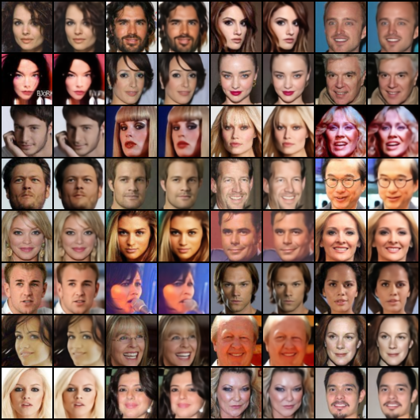
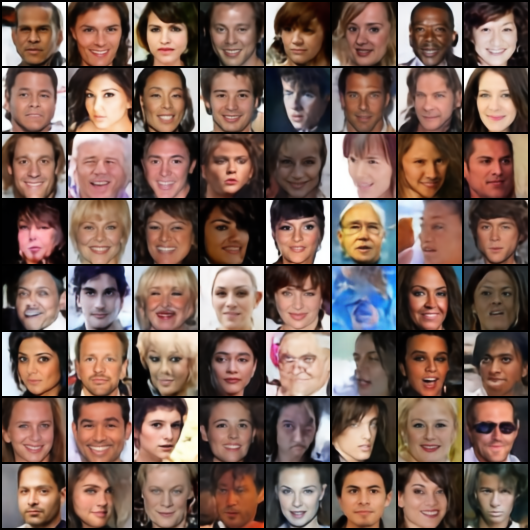
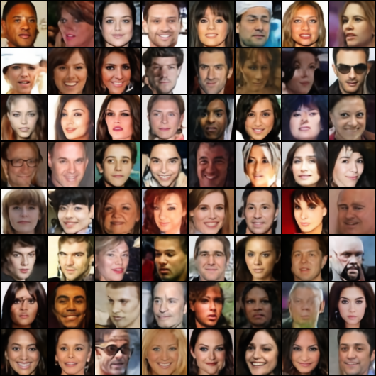

# VQVAE-pytorch

> Van Den Oord, Aaron, and Oriol Vinyals. "Neural discrete representation learning." Advances in neural information processing systems 30 (2017).

Unofficial implementations of VQVAE.

<br/>


## Installation

Clone this repo:

```shell
git clone https://github.com/xyfJASON/VQVAE-pytorch.git
cd VQVAE-pytorch
```

Create and activate a conda environment:

```shell
conda create -n vqvae python=3.11
conda activate vqvae
```

Install dependencies:

```shell
pip install -r requirements.txt
```

<br/>


## Training

VQVAE is trained in two stages: the first stage is to train the encoder, codebook, and decoder, and the second stage is to train a prior model (e.g., PixelCNN or Transformer) on top of the learned discrete representations.


### First-stage training

```shell
accelerate-launch train_vqvae.py -c CONFIG [-e EXP_DIR] [--xxx.yyy zzz ...]
```

- This repo uses the [🤗 Accelerate](https://huggingface.co/docs/accelerate/index) library for multi-GPUs/fp16 supports. Please read the [documentation](https://huggingface.co/docs/accelerate/basic_tutorials/launch#using-accelerate-launch) on how to launch the scripts on different platforms.
- Results (logs, checkpoints, tensorboard, etc.) of each run will be saved to `EXP_DIR`. If `EXP_DIR` is not specified, they will be saved to `runs/exp-{current time}/`.
- To modify some configuration items without creating a new configuration file, you can pass `--key value` pairs to the script.

For example, to train the model on CelebA with default configurations:

```shell
accelerate-launch train_vqvae.py -c ./configs/vqvae-celeba.yaml -e ./runs/celeba
```

To train the codebook via EMA K-means instead of VQ loss:

```shell
accelerate-launch train_vqvae.py -c ./configs/vqvae-celeba.yaml -e ./runs/celeba --model.params.codebook_update kmeans
```


### Prior learning (Transformer)

```shell
accelerate-launch train_transformer.py -c CONFIG [-e EXP_DIR] --vqvae.pretrained /path/to/vqvae/checkpoint [--xxx.yyy zzz ...]
```

<br/>


## Sampling

```shell
accelerate-launch sample.py -c CONFIG \
                            --vqvae_weights VQVAE_WEIGHTS \
                            --transformer_weights TRANSFORMER_WEIGHTS \
                            --n_samples N_SAMPLES \
                            --save_dir SAVE_DIR \
                            [--batch_size BATCH_SIZE] \
                            [--topk TOPK]
```


## Results


### CelebA 64x64

**Reconstruction**:

|                  VQ loss                   |                    EMA K-means                    |
| :----------------------------------------: | :-----------------------------------------------: |
|  |  |

Empirically, EMA K-means converges faster than VQ loss, but eventually their performance is similar.

**Random samples** (Transformer + VQVAE Decoder):

|                  VQ loss                   |                       EMA K-means                        |
| :----------------------------------------: | :------------------------------------------------------: |
|  |  |

