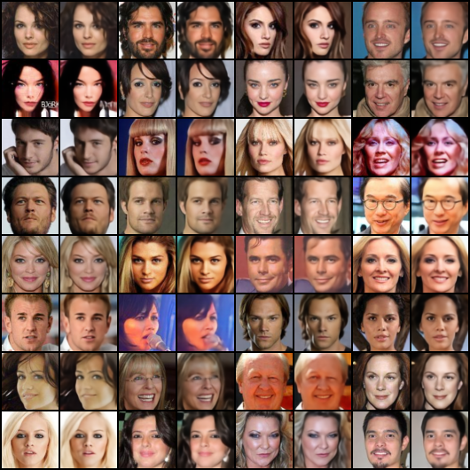

# VQVAE-pytorch

> Van Den Oord, Aaron, and Oriol Vinyals. "Neural discrete representation learning." Advances in neural information processing systems 30 (2017).

Unofficial implementations of VQVAE.

<br/>

## Installation

Clone this repo:

```shell
git clone https://github.com/xyfJASON/VQVAE-pytorch.git
cd VQVAE-pytorch
```

Create and activate a conda environment:

```shell
conda create -n vqvae python=3.11
conda activate vqvae
```

Install dependencies:

```shell
pip install -r requirements.txt
```

<br/>

## Training

### First-stage training

```shell
accelerate-launch train_vqvae.py [-c CONFIG] [-e EXP_DIR] [--xxx.yyy zzz ...]
```

- This repo uses the [🤗 Accelerate](https://huggingface.co/docs/accelerate/index) library for multi-GPUs/fp16 supports. Please read the [documentation](https://huggingface.co/docs/accelerate/basic_tutorials/launch#using-accelerate-launch) on how to launch the scripts on different platforms.
- Results (logs, checkpoints, tensorboard, etc.) of each run will be saved to `EXP_DIR`. If `EXP_DIR` is not specified, they will be saved to runs/exp-{current time}/.
- To modify some configuration items without creating a new configuration file, you can pass `--key value` pairs to the script.

For example, to train the model on CelebA:

```shell
accelerate-launch train_vqvae.py -c ./configs/vqvae-celeba.yaml -e ./runs/celeba
```

To train the codebook via EMA K-means instead of VQ loss:

```shell
accelerate-launch train_vqvae.py -c ./configs/vqvae-celeba.yaml -e ./runs/celeba --model.params.codebook_update kmeans
```

### Second-stage training (prior learning)

TODO

<br/>

## Results

### CelebA

**Reconstruction**:

<p style="text-align: center">
    
</p>
